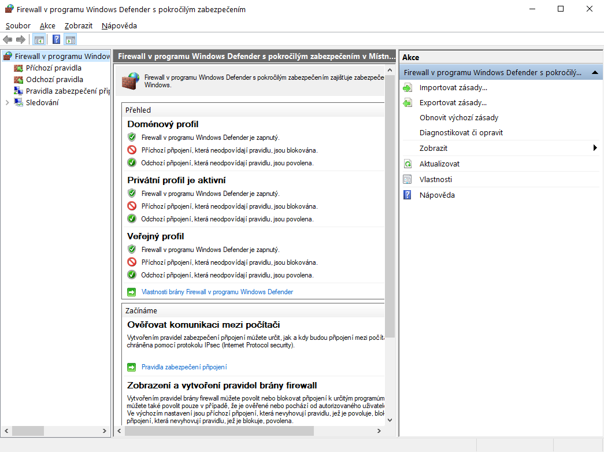

# Připojení se k převodníku
V horním panelu EthCanConfigu je část s nadpisem **Device:** a poli pro `IP Adresu`, `Uživatelské jméno` a `Heslo`, které budou použity pro připojení k převodníku přes SSH. Pro připojení stiskněte tlačítko **Connect** a počkejte asi 10 sekund. Pokud se připojení nepodařilo, zobrazí se vám chybová hláška. Pokud se podařilo, můžete zkusit zobrazit [Informace o zařízení](ShowInfo.md).

Aby bylo připojení možné, musíte být s převodníkem ve stejné síti a podsíti, k tomu můžete použít router, switch nebo přímé připojení k počítači (peer to peer). Síťová konfigurace není předmětem této dokumentace.

Ke kontrole, že je převodník a počítač ve stejné podsíti můžete použít příkaz `ping`, který můžete zadat do Příkazového řádku nebo okna Spustit, které vyvoláte stisknutím <kbd>Win+R</kbd>.

## Firewall
Pokud jste si jistí, že váš počítač a převodník jsou ve stejné podsíti a přesto se na něj nemůžete připojit, zkuste vytvořit povolovací pravidlo pro náš software ve firewallu.

Zvolte část Příchozí pravidla. V pravém panelu *Akce* klikněte na *Nové pravidlo...* - otevře se vám nové okno *Průvodce vytvořením nového pravidla*.

Nastvte v něm následující:
- Typ pravidla: Program
- Povolit připojení
- [x] Doména
- [x] Privátní
- [x] Veřejný

Stejný postup zopakujte i na stránce *Odchozí pravidla*.