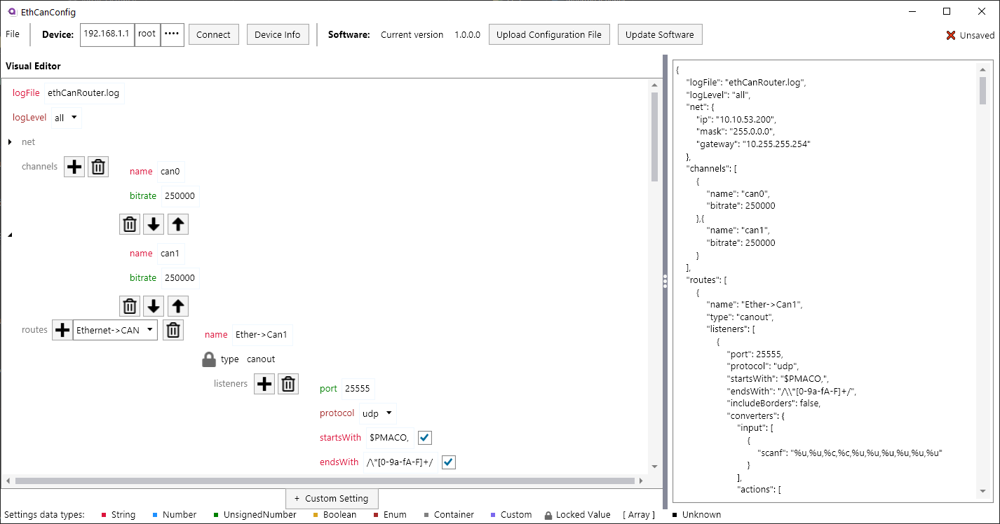

# EthCanConfig
  
## Stáhnutí
Tento program by měl být spustitelný na Windows a Linuxu  
TODO: Link na stažení

## Funkce
- [Vytváření](Creation.md) konfiguračních souborů pro převodník
- [Připojení se](Connecting.md) k převodníku
- [Nahrávání](Upload.md) konfiguračnich souborů na převodník
- [Získání](ShowInfo.md) informací o aktuálním softwaru převodníku

## Kompilace
Pokud si přejete tento software skompilovat, přejděte na [návod zde](/Compilation/Config.md)